# MVP — Fatores de Sucesso de Jogos na Steam

**Disciplina:** Engenharia de Dados

**Autor:** Murilo Patricio Maia

**Plataforma de nuvem:** Databricks Free Edition (Unity Catalog, Delta Lake, PySpark)

Este repositório contém o pipeline de dados construído como MVP da disciplina: coleta, modelagem, carga, checagem de qualidade e análise de um catálogo de jogos da Steam, seguindo a Arquitetura Medalhão (Bronze → Silver → Gold).

Os notebooks estão em [`notebooks/`](notebooks/), na ordem em que devem ser executados:

1. [`01_bronze_ingestao.ipynb`](notebooks/01_bronze_ingestao.ipynb)
2. [`02_silver_limpeza.ipynb`](notebooks/02_silver_limpeza.ipynb)
3. [`03_gold_modelagem.ipynb`](notebooks/03_gold_modelagem.ipynb)
4. [`04_analise.ipynb`](notebooks/04_analise.ipynb)

---

## Contexto de Negócio e Perguntas (Etapa 2 e 4.1)

### Problema de negócio

Entender quais fatores de um jogo publicado na Steam mais se relacionam com sua **aceitação pelos jogadores** (avaliações) e com sua **popularidade**, a partir dos metadados de conteúdo, preço, plataforma e engajamento disponíveis publicamente.

### Perguntas de negócio

1. Gênero/categoria influencia a proporção de avaliações positivas?
2. Preço tem relação com a avaliação (mais caro = melhor avaliado)?
3. Desconto ativo está associado a maior popularidade estimada?
4. Suporte multiplataforma está associado a maior popularidade/avaliação?
5. Tempo desde o lançamento impacta no volume acumulado de reviews?
6. Jogos com mais DLCs tendem a ter maior popularidade (efeito "franquia")?
7. Faixa etária exigida se relaciona com gênero, avaliação ou popularidade?
8. *(stretch)* Nota da crítica especializada está alinhada com a avaliação dos usuários?

Nenhuma pergunta foi descartada — todas as 8 foram respondidas com o dado disponível (ver seção **Análise de Dados**).

### Contexto dos dados brutos

A fonte de dados é o **[Steam Games Dataset 2025](https://www.kaggle.com/datasets/artermiloff/steam-games-dataset)** (Artemiy Ermilov, Kaggle), arquivo `games_march2025_full.csv`: uma coleta bruta ("raw", sem pré-processamento) de **94.948 jogos** da Steam, feita via scraping da loja combinado com a Steam API e o SteamSpy. Tem 47 colunas, das quais este projeto usa 19 — preço, desconto, plataformas suportadas, gênero/categoria, faixa etária mínima, quantidade de DLCs, nota do Metacritic, contagens de avaliação (de duas APIs diferentes) e popularidade estimada (`estimated_owners`, `peak_ccu`). As demais 28 colunas (descrições longas, URLs de imagem/vídeo, idiomas suportados, conquistas, tempo de jogo, desenvolvedores/publicadoras, tags) foram descartadas já na definição do objetivo por não se relacionarem a nenhuma das 8 perguntas.

**Histórico de decisão sobre a fonte:** o plano original cruzava esse arquivo com uma segunda fonte já pré-processada (`games.csv`, Anton Kozyriev, licença CC0). Essa segunda fonte foi abandonada depois de encontrarmos divergências relevantes entre as duas (preço divergindo em mais de $0,01 em 25,9% dos jogos em comum; percentual de avaliações positivas divergindo em mais de 5 pontos percentuais em 14,6% dos casos) — decidimos simplificar para uma única fonte em vez de carregar essa reconciliação entre datasets. Essa decisão está detalhada na seção de **Autoavaliação**.

### Licença

`games_march2025_full.csv` está sob **licença MIT** — uso livre, incluindo para fins acadêmicos, com atribuição. A fonte descartada (`games.csv`) estava sob **CC0 (domínio público)**.

---

## Carga dos Dados (Etapa 4.2)

O arquivo `games_march2025_full.csv` (~471 MB) foi baixado do Kaggle e enviado manualmente, pela interface do Databricks, para um **Volume do Unity Catalog** (`bronze.steam_games.raw_files`) — o mecanismo do Databricks para armazenar arquivos genéricos (CSV, JSON etc.) antes de virarem tabelas.

O notebook [`01_bronze_ingestao.ipynb`](notebooks/01_bronze_ingestao.ipynb) lê esse CSV do Volume com Spark (`multiLine`/`escape` habilitados, por conta de campos de texto longos com aspas e quebras de linha internas) e grava como tabela Delta `bronze.steam_games.games_full_raw`, com todas as colunas como `string` (a tipagem é responsabilidade da camada Silver) e duas colunas de controle: `_ingestion_timestamp` e `_source_file`.

Contagem de linhas validada: **94.948** (igual ao arquivo original — nenhuma linha perdida ou corrompida na leitura).

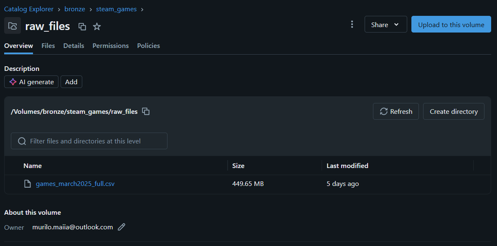

---

## Modelagem e Catálogo de Dados (Etapa 4.3)

### Estrutura de catálogos (Arquitetura Medalhão)

A organização segue a Arquitetura Medalhão diretamente na estrutura do Unity Catalog: um catálogo por camada — `bronze`, `silver`, `gold` — cada um com um schema `steam_games` agrupando as tabelas do projeto.

- `bronze.steam_games.games_full_raw` — dado bruto, tudo como `string`.
- `silver.steam_games.games` — dado limpo, tipado e enriquecido (89.729 linhas).
- `gold.steam_games.*` — Esquema Estrela pronto para responder as perguntas de negócio.

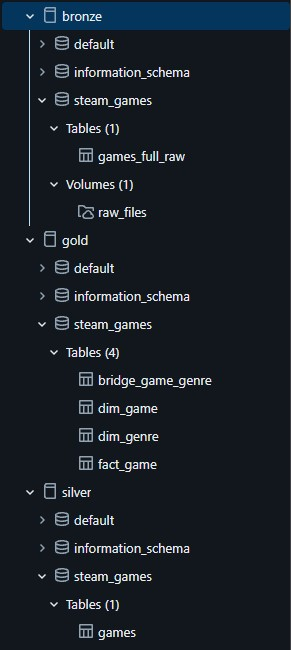

### Modelo Gold: Esquema Estrela

- **`fact_game`** — tabela fato, uma linha por jogo: as medidas numéricas (preço, desconto, nota da crítica, aceitação, volume de reviews, popularidade estimada).
- **`dim_game`** — dimensão, uma linha por jogo: atributos descritivos (título, data de lançamento, faixa etária, plataformas), incluindo colunas derivadas usadas diretamente pelas perguntas de negócio.
- **`dim_genre`** — dimensão: os gêneros distintos do catálogo.
- **`bridge_game_genre`** — tabela ponte: resolve o relacionamento N:N entre jogo e gênero (um jogo pode ter vários gêneros; um gênero pertence a vários jogos) — é a única relação do modelo que não cabe numa dimensão simples.

`fact_game` e `dim_game` compartilham a mesma granularidade (uma linha por jogo, relacionadas 1:1 por `app_id`) — foram separadas para isolar medidas de atributos descritivos, não por redução de grão (não há uma dimensão "tempo" ou "transação" natural aqui; cada jogo é a própria unidade de análise).

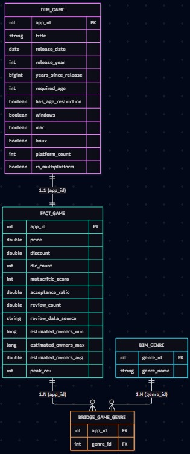

*Diagrama do Esquema Estrela: `dim_game` e `fact_game` relacionadas 1:1 por `app_id`; `bridge_game_genre` liga `fact_game` (1:N por `app_id`) e `dim_genre` (1:N por `genre_id`), resolvendo o relacionamento N:N entre jogo e gênero.*

### Catálogo de Dados

Linhagem de todas as tabelas: `games_march2025_full.csv` (Kaggle, MIT) → `bronze.steam_games.games_full_raw` (dado bruto) → `silver.steam_games.games` (limpo/tipado) → tabelas Gold abaixo.

#### `gold.steam_games.fact_game`
Grão: uma linha por jogo (`app_id`).

| Coluna | Tipo | Domínio | Descrição |
|---|---|---|---|
| `app_id` | int | identificador único da Steam | Chave do jogo (PK, FK para `dim_game`) |
| `price` | double | 0 a ~1000 (USD) | Preço atual do jogo |
| `discount` | double | 0 a 100 | Percentual de desconto no momento da coleta |
| `dlc_count` | int | ≥ 0 | Quantidade de DLCs do jogo |
| `metacritic_score` | int | 1 a 100, nulo se sem nota | Nota da crítica especializada (Metacritic). Nulo em ~96% dos jogos |
| `acceptance_ratio` | double | 0 a 100, nulo se sem review | % de avaliações positivas, com fallback entre Steam API e SteamSpy (ver `review_data_source`) |
| `review_count` | double | ≥ 0, nulo se sem review | Volume de reviews, mesma lógica de fallback |
| `review_data_source` | string | `steam_api`, `steamspy` ou nulo | De qual API vieram `acceptance_ratio`/`review_count` nesta linha |
| `estimated_owners_min`/`estimated_owners_max` | long | faixas fixas da fonte (ex. 0-20.000, 20.000-50.000, ...) | Limites da faixa de posse estimada (SteamSpy) |
| `estimated_owners_avg` | double | ponto médio da faixa | Estimativa pontual de popularidade, usada nas perguntas 3 e 6 |
| `peak_ccu` | int | ≥ 0 | Pico de jogadores simultâneos observado |

#### `gold.steam_games.dim_game`
Grão: uma linha por jogo (`app_id`).

| Coluna | Tipo | Domínio | Descrição |
|---|---|---|---|
| `app_id` | int | identificador único da Steam | Chave do jogo (PK) |
| `title` | string | texto livre | Nome do jogo. 2 jogos sem nome na fonte original recebem "(nome não informado)" |
| `release_date` | date | 1997-06-30 a 2025-03-10 | Data de lançamento na Steam |
| `release_year` | int | 1997 a 2025 | Ano de lançamento, derivado de `release_date` |
| `years_since_release` | bigint | 0 a 27 | Anos completos entre o lançamento e a data de coleta do dataset (2025-03-10, a `release_date` mais recente), usado na pergunta 5 |
| `required_age` | int | 0, 1, 3, 6, 7, 10, 12, 13, 14, 15, 16, 17, 18, 20, 21; nulo se inválido | Faixa etária mínima exigida. 98,9% dos jogos têm valor 0 (sem restrição) |
| `has_age_restriction` | boolean | true/false | `required_age > 0`, usado na pergunta 7 |
| `windows`/`mac`/`linux` | boolean | true/false | Suporte declarado a cada plataforma |
| `platform_count` | int | 0 a 3 | Quantas das 3 plataformas o jogo suporta |
| `is_multiplatform` | boolean | true/false | `platform_count >= 2`, usado na pergunta 4 |

#### `gold.steam_games.dim_genre`
Grão: um gênero distinto.

| Coluna | Tipo | Domínio | Descrição |
|---|---|---|---|
| `genre_id` | int | sequencial, 1 a 33 | Chave substituta do gênero (PK) |
| `genre_name` | string | 33 valores distintos (ex.: Action, Indie, RPG, Simulation...) | Nome do gênero, como declarado na fonte |

#### `gold.steam_games.bridge_game_genre`
Grão: um par (jogo, gênero). Resolve o N:N entre `dim_game` e `dim_genre`.

| Coluna | Tipo | Domínio | Descrição |
|---|---|---|---|
| `app_id` | int | FK para `dim_game`/`fact_game` | Jogo |
| `genre_id` | int | FK para `dim_genre` | Gênero associado ao jogo |

Um jogo pode ter zero (228 casos, 0,3%), um ou vários gêneros; um gênero está associado a vários jogos.

Contagens: `dim_game`/`fact_game` = 89.729 linhas cada; `dim_genre` = 33; `bridge_game_genre` = 258.243.

Script: [`03_gold_modelagem.ipynb`](notebooks/03_gold_modelagem.ipynb).

---

## Pipeline de Dados (Etapa 4.4)

### Organização

O pipeline é **ramificado**: um notebook por camada/etapa, cada um lendo a tabela produzida pelo anterior.

| Notebook | Camada | O que faz |
|---|---|---|
| [`01_bronze_ingestao.ipynb`](notebooks/01_bronze_ingestao.ipynb) | Bronze | Lê o CSV do Volume, grava como Delta sem nenhuma transformação (tudo `string` + metadados de controle) |
| [`02_silver_limpeza.ipynb`](notebooks/02_silver_limpeza.ipynb) | Silver | Varredura sistemática de qualidade (completude/consistência/acurácia/unicidade/outliers) + limpeza, tipagem e enriquecimento |
| [`03_gold_modelagem.ipynb`](notebooks/03_gold_modelagem.ipynb) | Gold | Monta o Esquema Estrela (`fact_game`, `dim_game`, `dim_genre`, `bridge_game_genre`) |
| [`04_analise.ipynb`](notebooks/04_analise.ipynb) | Análise | Responde as 8 perguntas de negócio a partir do Gold |

### Transformações principais (Bronze → Silver)

- **Filtro de "Playtest":** 5.219 registros (5,5%) removidos — são builds de teste da Steam, não o jogo real.
- **Tipagem:** todas as colunas `string` convertidas para `int`/`double`/`date`/`boolean` conforme o Catálogo de Dados.
- **Parsing de listas:** `genres`/`categories` (texto no formato de lista Python) convertidos para `array<string>`.
- **Parsing de faixa:** `estimated_owners` (texto `"100000 - 200000"`) convertido em `estimated_owners_min`/`max`/`avg`.
- **Métrica de aceitação com fallback:** `acceptance_ratio`/`review_count` calculados a partir de `positive`/`negative` (Steam API) quando disponível, com fallback para `pct_pos_total`/`num_reviews_total` (SteamSpy) quando a primeira fonte não tem dado — cobre 88,4% dos registros da Bronze, contra 76,5% ou 58,3% usando cada campo isoladamente (detalhes na seção de Qualidade de Dados).

Todas as transformações estão documentadas, com o porquê de cada decisão, nas células markdown do notebook [`02_silver_limpeza.ipynb`](notebooks/02_silver_limpeza.ipynb).

---

## Qualidade de Dados (Etapa 4.5 — parte 1)

A checagem de qualidade cobre as 5 dimensões pedidas — **completude, consistência, unicidade, acurácia e outliers** — para os 19 atributos usados no projeto, no notebook [`02_silver_limpeza.ipynb`](notebooks/02_silver_limpeza.ipynb).

### Perfil sistemático (completude, consistência, acurácia)

Rodado sobre os 19 atributos de uma vez. Resultado: **nenhum problema de consistência ou domínio em nenhum atributo**, exceto:

| Atributo | Achado | Quantidade |
|---|---|---|
| `name` | nulo/vazio | 2 registros (0,002%) |
| `required_age` | fora do domínio (valor -1, negativo) | 1 registro |

### Unicidade

| Achado | Quantidade | Decisão |
|---|---|---|
| `appid` duplicado | 0 | Nenhuma ação necessária |
| Mesma ficha de loja (nome, descrição, preço, gêneros...) repetida sob `appid`s diferentes | 82 linhas em 28 grupos (0,09%) — ex.: "Shadow of the Tomb Raider: Definitive Edition" aparece em 20 `appid`s | Mantidas — a Steam cria múltiplos `appid` para variantes de edição/pacote/SKU do mesmo jogo; cada um é uma listagem real e independente, com preço e reviews próprios. Limitação conhecida: perguntas agregadas por gênero/preço/DLC dão peso maior a franquias com muitas variantes de SKU |

### Outliers (percentil 99,9%, não IQR)

O critério clássico de outlier (`Q3 + IQR`) quebra em colunas com excesso de zeros (`discount`, `dlc_count`, `peak_ccu`, `required_age`) — o próprio 1º e 3º quartil caem em zero, e qualquer valor positivo pareceria "outlier". Por isso o critério usado é por percentil: valores acima do percentil 99,9% (os 0,1% mais extremos).

| Atributo | Máximo | Outliers (>p99,9) | Exemplo |
|---|---|---|---|
| `price` | $999,98 | 8 | Softwares de nicho/empresariais vendidos como "jogo" (ex.: "Ascent Free-Roaming VR Experience") |
| `discount` | 100% | 1 | "Isle of Jura" — temporariamente gratuito na coleta |
| `dlc_count` | 3.427 | 89 (os 3 mais extremos: 3.427, 2.004, 1.191) | Fantasy Grounds VTT/Classic e Rocksmith 2014 — vendem centenas de complementos pequenos como "DLC" |
| `required_age` | 21 | 2 | "Paintings Thief" (20), "Yet Another Waveshooter" (21) |
| `metacritic_score` | 97 | 3 | GTA V Legacy (96), Baldur's Gate 3 (96), Disco Elysium - The Final Cut (97) — os mais bem avaliados pela crítica |
| `positive`/`negative`/`peak_ccu` | milhões | 94 cada | Mercado da Steam é extremamente concentrado (ex.: Counter-Strike 2) |

Todos os outliers acima são **valores reais, não erro de coleta** — mantidos no conjunto de dados, com a ressalva documentada de que distorcem médias simples nas colunas afetadas.

### Achado de reconciliação entre APIs

O arquivo combina duas fontes de contagem de review — Steam API (`positive`/`negative`) e SteamSpy (`pct_pos_total`/`num_reviews_total`) — e elas nem sempre concordam sobre quais jogos têm dado disponível:

| Situação | Quantidade | % |
|---|---|---|
| Só SteamSpy tem dado (`positive`+`negative` = 0) | 11.248 | 11,8% |
| Só Steam API tem dado (`pct_pos_total` ausente) | 28.523 | 30,0% |
| Nenhuma das duas tem dado | 11.052 | 11,6% |
| As duas têm dado | 44.125 | 46,5% |

**Tratamento:** `acceptance_ratio`/`review_count` calculados com fallback entre as duas fontes, cobrindo 88,4% dos registros da Bronze.

### Outras transformações

- `metacritic_score == 0` (91.372 de 94.948, 96,2%) tratado como nulo — 0 é sentinela de "sem nota", não uma nota real (Metacritic não pontua 0).
- `required_age < 0` (1 registro) tratado como nulo — idade negativa é inválida.
- `positive`/`negative` brutos não entram na tabela final (nenhuma pergunta de negócio usa contagem absoluta) — substituídos por `review_data_source`, que documenta a linhagem de onde vieram `acceptance_ratio`/`review_count`.

---

## Análise de Dados (Etapa 4.5 — parte 2)

Respostas às 8 perguntas de negócio, a partir do Esquema Estrela Gold. Consulta técnica completa (PySpark) em [`04_analise.ipynb`](notebooks/04_analise.ipynb).

### 1. Gênero/categoria influencia a proporção de avaliações positivas?

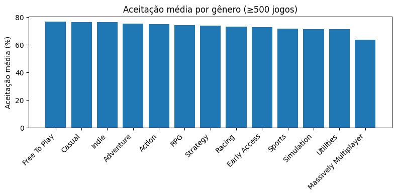

Entre os gêneros com pelo menos 500 jogos, a maioria fica concentrada numa faixa estreita (71-77% de aceitação média) — Free To Play, Casual e Indie no topo (~76,5%). O destaque é **Massively Multiplayer**, com aceitação média de **63,7%**, claramente abaixo de todos os outros. Gênero tem relação com a aceitação, mas o efeito é modesto — exceto para jogos multiplayer massivos, que consistentemente performam pior, provavelmente por dependerem mais de infraestrutura de servidor, balanceamento contínuo e suporte pós-lançamento.

### 2. Preço tem relação com a avaliação (mais caro = melhor avaliado)?

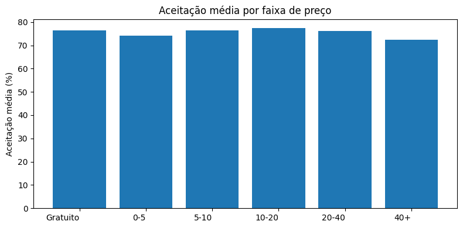

A correlação entre preço e aceitação é praticamente nula (**0,004**), e as médias por faixa de preço ficam todas entre 72% e 77%, sem tendência clara — a faixa mais cara (40+) tem, na verdade, a menor aceitação média (72,4%). **A resposta é não**: preço não explica a variação na avaliação dos jogadores nesta base.

### 3. Desconto ativo está associado a maior popularidade estimada?

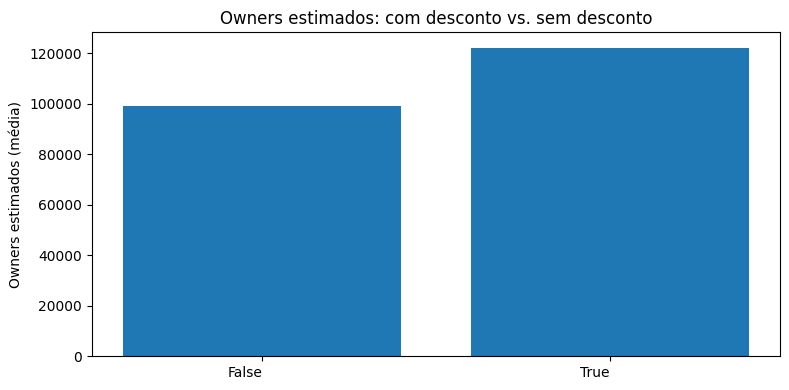

Jogos com desconto ativo têm, em média, 22.882 owners estimados a mais que os sem desconto (122.213 vs. 99.332) e pico de jogadores simultâneos também maior. Há associação, mas a direção causal não é óbvia: pode ser que descontos aumentem a popularidade, ou o inverso — jogos já populares são os que mais entram em campanhas de desconto.

### 4. Suporte multiplataforma está associado a maior popularidade/avaliação?

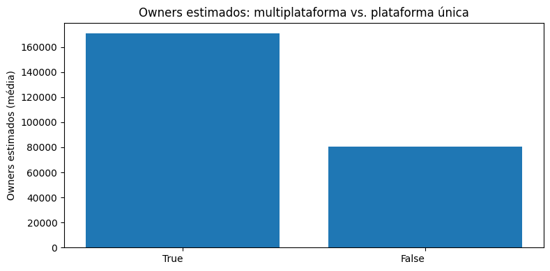

Jogos multiplataforma têm aceitação média maior (79,7% vs. 74,3%) e mais que o dobro de owners estimados (170.715 vs. 80.406). **A resposta é sim**, e é a relação mais consistente encontrada (fora DLCs). Suportar múltiplas plataformas pode ser um proxy de investimento/qualidade de produção, não necessariamente a causa direta.

### 5. Tempo desde o lançamento impacta no volume acumulado de reviews?

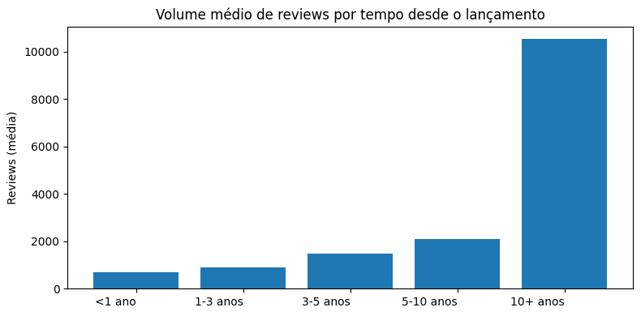

A idade de cada jogo é medida até a data de coleta do dataset (2025-03-10), o mesmo momento em que as reviews foram contadas. O volume médio de reviews cresce de forma consistente com a idade — de 677 (menos de 1 ano) para 10.523 (10+ anos), cerca de 15x mais, subindo em todas as faixas intermediárias. **A resposta é sim**, o resultado mais esperado da análise: reviews se acumulam ao longo do tempo. Isso também é um alerta — `review_count` sozinho favorece jogos antigos, não necessariamente jogos "melhores".

### 6. Jogos com mais DLCs tendem a ter maior popularidade (efeito "franquia")?

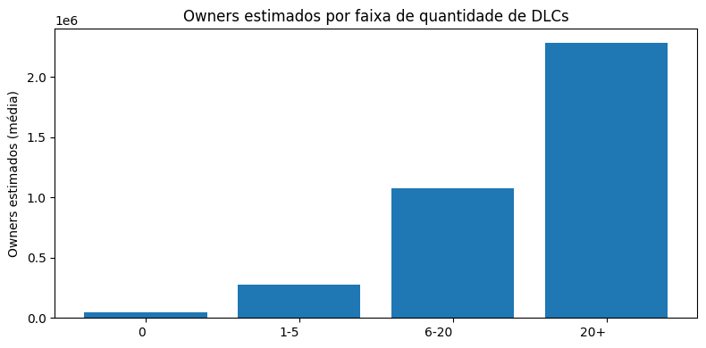

A relação mais forte de toda a análise: jogos sem DLC têm em média 50.178 owners estimados; jogos com mais de 20 DLCs têm 2.286.542 — quase **45 vezes mais**. **A resposta é claramente sim**, confirmando o "efeito franquia": editoras continuam investindo em DLC para jogos que já venderam bem, e mais DLC mantém o jogo relevante por mais tempo.

### 7. Faixa etária exigida se relaciona com gênero, avaliação ou popularidade?

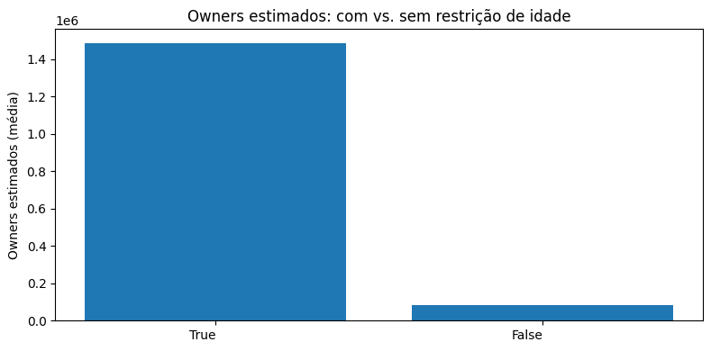

Apenas 1.056 jogos (1,2%) declaram `required_age > 0` — a ressalva de amostra pequena da Etapa 1 se confirma. Dentro dessa amostra, a aceitação média é ligeiramente menor (73,9% vs. 75,6%), mas o `estimated_owners` médio é quase 17,5 vezes maior (1.486.851 vs. 84.733). Os gêneros mais comuns nesse grupo são Action, Adventure, Indie e RPG. A leitura mais provável não é "restrição de idade causa popularidade": com uma amostra tão pequena, a média é muito sensível a poucos títulos de grande sucesso (a popularidade na Steam é extremamente concentrada), e bastam alguns jogos de grande porte com classificação indicativa declarada para multiplicar a média do grupo — uma associação influenciada pela composição da amostra, não um efeito da faixa etária em si.

### 8. (stretch) Nota da crítica está alinhada com a avaliação dos usuários?

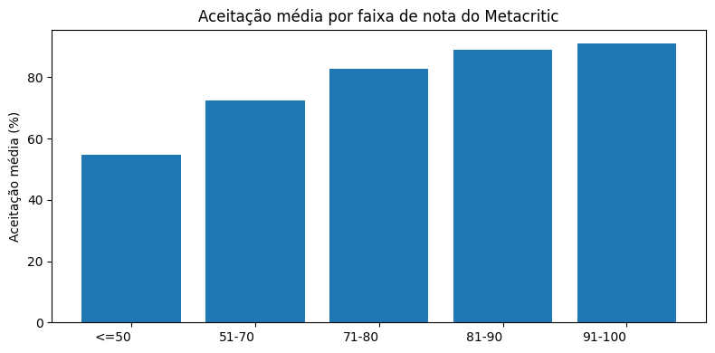

Só 3.574 jogos (4,0%) têm `metacritic_score`. Dentro desse subconjunto, a correlação com `acceptance_ratio` é **0,60** (moderada a forte), com tendência monotônica: de 54,7% de aceitação média (nota ≤50) a 91,0% (nota 91-100). **A resposta é sim, quando a nota existe**: crítica especializada e avaliação dos jogadores tendem a apontar na mesma direção, mas com dispersão suficiente para não serem intercambiáveis.

### Discussão geral

Voltando ao problema original — quais fatores mais se relacionam com aceitação e popularidade de um jogo na Steam:

- **Fatores associados à popularidade:** a quantidade de DLCs é o fator mais forte encontrado (quase 45x de diferença), seguido pelo suporte multiplataforma (2x) e, mais fracamente, desconto ativo (+23%). A faixa etária mostrou diferença grande (17,5x), mas provavelmente reflete viés de amostra, não efeito real.
- **Fatores associados à aceitação:** a nota da crítica especializada é o sinal mais forte (correlação 0,60), mas só existe para 4% dos jogos. Gênero tem efeito modesto, com Massively Multiplayer performando consistentemente pior. **Preço não mostrou relação nenhuma com aceitação** — um achado que contraria a intuição de que jogos mais caros seriam mais bem avaliados.
- Volume de reviews cresce com o tempo, como esperado — o que reforça que comparações de popularidade entre jogos de idades muito diferentes precisam normalizar por tempo de mercado.

Todas as 8 perguntas do objetivo foram respondidas com os dados disponíveis; nenhuma foi descartada.

---

## Autoavaliação

Considero que os objetivos traçados no início do trabalho foram alcançados: defini um problema de negócio claro sobre jogos da Steam, formulei 8 perguntas específicas, construí um pipeline completo na nuvem seguindo a Arquitetura Medalhão (Bronze → Silver → Gold), modelei os dados num Esquema Estrela documentado por um Catálogo de Dados, fiz uma checagem de qualidade sistemática nas 5 dimensões pedidas, e respondi todas as 8 perguntas com dado real, sem descartar nenhuma.

As maiores dificuldades não foram na parte de operar o Databricks, mas nas etapas anteriores a ele:

- **Encontrar um dataset real e adequado.** Boa parte do tempo inicial foi gasto avaliando datasets no Kaggle até achar um que realmente sustentasse as 8 perguntas que eu queria responder, com colunas suficientes e volume de dados razoável para um MVP.
- **Tratar os dados**, principalmente por se tratar de um dataset que originalmente cruzava **duas fontes diferentes** (e, mesmo depois de simplificar para uma fonte única, esse dataset por sua vez combina **duas APIs de origem diferentes** — Steam API e SteamSpy — para os números de review). Cada cruzamento de fontes trouxe um tipo de inconsistência que eu não esperava: primeiro entre os dois datasets do Kaggle (preço e nota de review divergindo em uma fração relevante dos jogos em comum), depois dentro do próprio dataset escolhido (os dois pares de campos de review cobrindo conjuntos parcialmente diferentes de jogos). Entender que a solução não era "escolher uma fonte e descartar a outra", e sim construir uma métrica com fallback que aproveitasse o que cada fonte cobria melhor, foi o principal aprendizado técnico do projeto.

### Trabalhos futuros

- **Consolidar jogos com múltiplas listagens (`appid`).** A checagem de qualidade encontrou 28 grupos de jogos com a mesma ficha de loja sob `appid`s diferentes (variantes de edição/pacote/SKU, como o caso de "Shadow of the Tomb Raider" com 20 `appid`s). Um trabalho futuro poderia agrupar essas variantes num "jogo canônico" antes da análise, removendo o peso desproporcional que franquias com muitas SKUs recebem em agregações por gênero, preço ou DLC.
- **Retomar a fonte descartada como enriquecimento, não como fonte concorrente.** `recommendations.csv`/`users.csv` — arquivos que acompanham a fonte descartada (dataset de Anton Kozyriev, CC0), com 41 milhões de reviews individuais — foram deixados de fora por volume, mas poderiam alimentar uma análise de série temporal de avaliações, ou um sistema de recomendação, como extensão do projeto.
- **Ampliar a cobertura de `metacritic_score`** (hoje só 4% dos jogos) cruzando com outra fonte de notas de crítica, para fortalecer a pergunta 8 além dos dados que a Steam já expõe.
- **Ir além de correlação simples**: um modelo de regressão ou de classificação para prever `acceptance_ratio`/`estimated_owners` a partir dos atributos do jogo permitiria quantificar o efeito de cada fator controlando pelos demais (isolar, por exemplo, se o efeito do suporte multiplataforma se sustenta depois de controlar por orçamento/gênero), algo que as comparações par a par feitas aqui não conseguem fazer.
